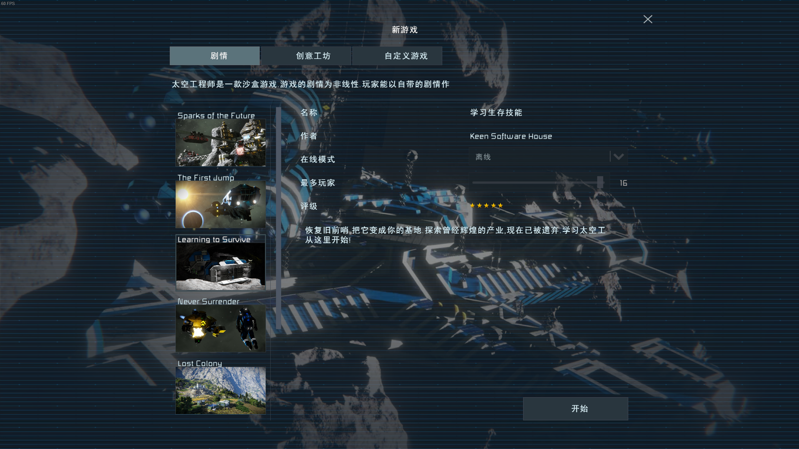

# 第一次玩太空工程师

## 购买与安装游戏

`太空工程师` 目前只有 PC 版本, 仅在 steam 发售. 为了能游玩此游戏, 你必须首先有一台通用计算机\(带有兼容 x86\_64 指令集的 windows 操作系统\)并已安装 steam.

购买所需的通用计算机: [https://mall.jd.com/index-1000001343.html](https://mall.jd.com/index-1000001343.html)

安装操作系统: [https://www.microsoft.com/en-us/software-download/windows10](https://www.microsoft.com/en-us/software-download/windows10)

安装 steam: [https://store.steampowered.com/about/](https://store.steampowered.com/about/)

如果因金钱或智力问题无法完成上述操作, 请立即关闭此页面.

太空工程师 英文原名 ''Space Engineers", 请直接在 steam 客户端搜索此字符串, 或者使用网页版 [https://store.steampowered.com/app/244850/Space\_Engineers/](https://store.steampowered.com/app/244850/Space_Engineers/)

点击购买并使用你喜欢的付款方式完成支付. 购买后在 steam 客户端找到此游戏并点击安装.

## 游戏教程

游戏自带有一个教程关卡, 游戏主菜单 -&gt; 新游戏 -&gt; Learning to Survive

把这教程关卡玩了就精通了, 再问无.

其他几个自带的关卡有一些通关后可以拿到游戏成就, 喜欢全收集的玩家可以试一试.

## 进入服务器

游戏主菜单 -&gt; 加入世界 -&gt; 服务器

找到你喜欢的服务器双击进入.

如果进入服务器时提示服务器为实验模式, 请到游戏设置里开启此选项.

游戏主菜单 -&gt; 选项 -&gt; 游戏 -&gt; 实验模式

## 在服务器里怎么玩

除了在服务器可以遇到其他玩家之外, 游戏内容和单机没有差异. 别的玩家可能会和你友好相处也可能会害你, 农村路也滑人心更复杂.

