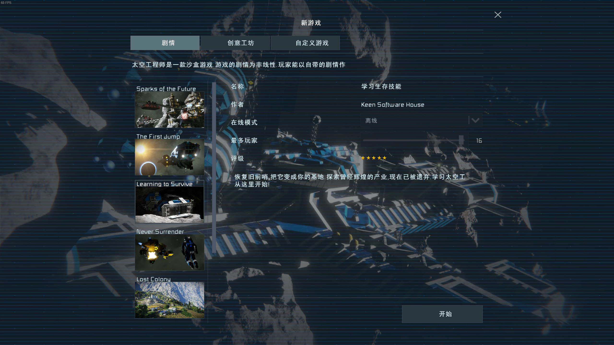

# 第一次玩太空工程师

## 购买与安装游戏

太空工程师目前仅有 Windows 版本且只在 Steam 平台发售.

如果没有电脑请关闭此页面.

如果没有 Windows 操作系统请首先安装操作系统 [https://www.microsoft.com/en-us/software-download/windows10](https://www.microsoft.com/en-us/software-download/windows10)

如果没有 Steam 平台请先安装平台 [https://store.steampowered.com/about/](https://store.steampowered.com/about/)

在 Steam 客户端搜索 ''Space Engineers" 即可找到游戏, 或者使用网页版 [https://store.steampowered.com/app/244850/Space\_Engineers/](https://store.steampowered.com/app/244850/Space\_Engineers/)

在 Steam 商店页面点击购买并使用你喜欢的付款方式完成支付. 购买后在 Steam 客户端找到此游戏并点击安装.

## 游玩游戏教程

游戏自带有一个教程关卡, 游戏主菜单 -> 新游戏 -> Learning to Survive

游戏教程包含基本的操作和玩法介绍, 请务必首先游玩教程.

其他几个自带的关卡有一些通关后可以拿到游戏成就, 喜欢全收集的玩家可以试一试.

## 进入服务器

游戏主菜单 -> 加入世界 -> 服务器

找到你喜欢的服务器双击进入.

如果进入服务器时提示服务器为实验模式, 请到游戏设置里开启此选项.

游戏主菜单 -> 选项 -> 游戏 -> 实验模式

.png>)

在服务器列表搜索 "211" 即可找到本服务器, 或者使用链接进服 [steam://connect/se.211server.com:27017](steam://connect/se.211server.com:27017)

进入服务器时会自动下载并启用服务器所用的 mod, 正常情况下不需要手动处理 mod.

若 mod 下载过慢请手动订阅合集 [https://steamcommunity.com/sharedfiles/filedetails/?id=2153927396](https://steamcommunity.com/sharedfiles/filedetails/?id=2153927396) . 订阅后, Steam 客户端会主动下载服务器所有 mod.

## 在服务器里怎么玩

单机和服务器的游玩内容没有差异, 唯一的区别只是可以结识其他玩家.

万丈深潭终有底，只有人心不可量!
